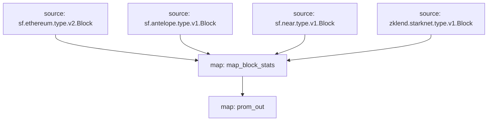

# `Subtivity` Substreams

[](https://github.com/pinax-network/subtivity-substreams/actions?query=branch%3Amain)

> Block level activity per for each supported chains **powered by Pinax**.

## Data

- [x] Transaction Count
- [x] Action Count (Events)
- [x] UAW (Unique Active Wallets)

## Chains

- [x] Ethereum
  - [x] Polygon
  - [x] Binance Smart Chain
  - [x] Goerli
  - [x] Sepolia
  - [x] Rinkeby
  - [x] Mumbai
- [x] Antelope
  - [x] EOS
  - [x] WAX
  - [x] Telos
- [x] Near
- [x] Starknet
- [ ] Aptos

### Quickstart

```
$ make
$ make run
$ make gui
```

### Graph



### Modules

```yaml
Package name: subtivity_ethereum
Version: v0.3.0
Doc: Subtivity for Ethereum
Modules:
----
Name: map_block_stats
Initial block: 0
Kind: map
Output Type: proto:subtivity.v1.BlockStats
Hash: 93725ab06a11557d2f157350311fb73d3ac7437e

Name: graph_out
Initial block: 0
Kind: map
Output Type: proto:sf.substreams.sink.entity.v1.EntityChanges
Hash: 1f82803e2e060d89fdcbc410c078cb619b2604fd
```
