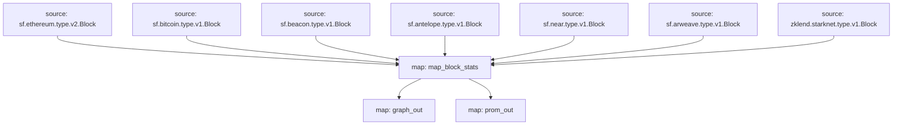

# `Subtivity` Substreams

[](https://github.com/pinax-network/subtivity-substreams/actions?query=branch%3Amain)

> Block level activity per for each supported chains **powered by Pinax**.

## Data

- [x] Transaction Count
- [x] Action Count (Events)
- [x] UAW (Unique Active Wallets)
- [x] Blobs (Beacon Chain)

## Chains

- [x] Bitcoin
- [x] EVM
  - [x] Ethereum
  - [x] Polygon
  - [x] Binance Smart Chain
  - [x] Optimism (OP)
- [x] EVM (Testnets)
  - [x] Goerli
  - [x] Holesky
  - [x] Sepolia
  - [x] Rinkeby
  - [x] Mumbai
  - [x] Chapel (BSC)
- [x] EVM Beacon Chain (Blobs)
  - [ ] Ethereum (March 11, 2024)
  - [ ] Gnosis (March 13, 2024)
  - [x] Goerli
  - [x] Holesky
  - [x] Sepolia
- [ ] EVM (RPC Poller)
  - [ ] EOS EVM
- [x] Antelope
  - [x] EOS
  - [x] WAX
  - [x] Telos
- [x] Near
- [x] Starknet
- [x] Arweave
- [ ] ~~Cosmos~~
  - [ ] ~~Osmosis~~

## Map Outputs

### `map_block_stats`

```json
{
  "transactionTraces": "213",
  "traceCalls": "1093",
  "uaw": [
    "4239a4e3a00a5282b6df7c19bd16cbf761b2c21f",
    "b18ccf69940177f3ec62920ddb2a08ef7cb16e8f",
    "603288a144fabf14a6c9806e9baadc9dbc1e9fd6",
    "0555262d2f4889522c3d7c0762d3c92e2ce817d1",
    "dc7bda95b512f7b9feb17566b80fa6bca5bb1693",
    "5c3efbafc55565d66312235428daf4988a4e41dc",
    ...
  ],
  "blobs": 0
}
```

### Quickstart

```
$ make
$ make run
$ make gui
```

### Graph



### Modules

```yaml
Package name: subtivity_ethereum
Version: v0.5.0
Doc: Subtivity for Ethereum
Modules:
----
Name: map_block_stats
Initial block: 0
Kind: map
Output Type: proto:subtivity.v1.BlockStats
Hash: afad04cb610be9b544643c1c519f54ea7d2babbb

Name: graph_out
Initial block: 0
Kind: map
Output Type: proto:sf.substreams.sink.entity.v1.EntityChanges
Hash: 8053a7cade8ca84faf1d3996d2102c9da436a52e

Name: prom_out
Initial block: 0
Kind: map
Output Type: proto:pinax.substreams.sink.prometheus.v1.PrometheusOperations
Hash: eea553b4332bf33cb85bb9ac106bba97cc1ed126
```
