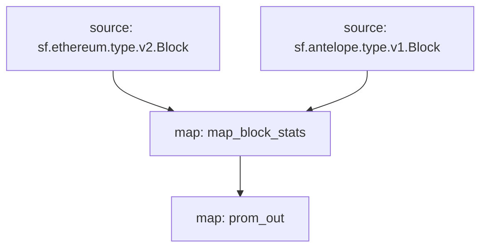

# `Subtivity` Substreams

[](https://github.com/pinax-network/subtivity-substreams/actions?query=branch%3Amain)

> Block level activity per for each supported chains **powered by Pinax**.

## Data

- [x] Transaction Count
- [x] Action Count (Events)
- [x] UAW (Unique Active Wallets)

## Chains
- [x] Ethereum
  - [x] Polygon
  - [x] Binance Smart Chain
  - [x] Goerli
  - [x] Sepolia
  - [x] Rinkeby
  - [x] Mumbai
- [x] Antelope
  - [x] EOS
  - [x] WAX
  - [x] Telos
- [x] Near

### Quickstart

```
$ make
$ make run
$ make gui
```

### Graph



### Modules

```yaml
Package name: subtivity_ethereum
Version: v0.2.1
Doc: Subtivity for Ethereum
Modules:
----
Name: map_block_stats
Initial block: 0
Kind: map
Output Type: proto:subtivity.v1.BlockStats
Hash: aa5dd16dc1185ca3628dd16ff2ebcad68f08688f

Name: prom_out
Initial block: 0
Kind: map
Output Type: proto:pinax.substreams.sink.prometheus.v1.PrometheusOperations
Hash: 0003de38e0c5b97cb4fd6f45a5aa784a23275916
```
