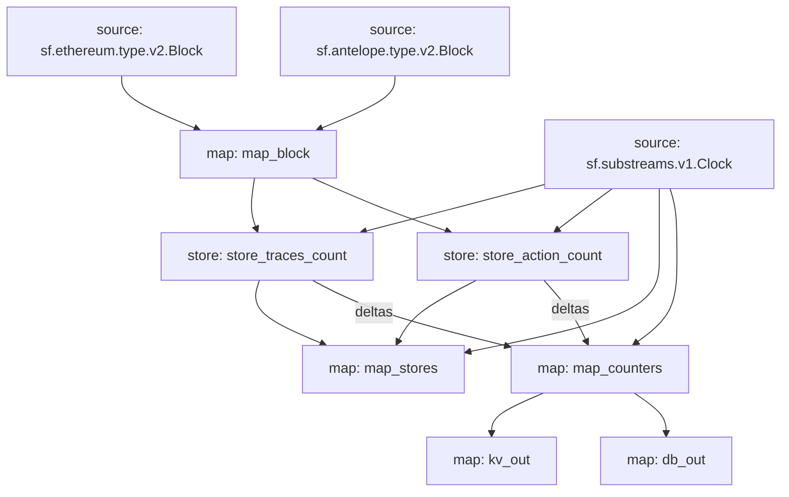

# `Subtivity` Substreams

[](https://github.com/pinax-network/subtivity-substreams/actions?query=branch%3Amain)

> Block level activity per for each supported chains **powered by Pinax**.

## Data

- [x] Transaction Count
- [x] Action Count (Events)
- [ ] UAW (Unique Active Wallets)

## Chains

- [x] Ethereum
- [x] Antelope
- [ ] Polygon
- [ ] Binance Smart Chain

### Quickstart

```
$ substreams run map_counters -t +200 -o jsonl
```

**Running no-ETH chains**

```
$ substreams run -e <ENDPOINT> substreams.<CHAIN>.yaml map_counters -t +200 -o jsonl
```

### Deploy [`Badger DB`](https://github.com/dgraph-io/badger)

1. [Installing `Badger`](https://github.com/dgraph-io/badger#installing)
2. Run the sink: `substreams-sink-kv run badger3://badger_data.db mainnet.eth.streamingfast.io:443 substreams.yaml kv_out`


### Graph



### Modules (Ethereum)

```yaml
Package name: subtivity_eth
Version: v0.1.0
Doc: Subtivity for ETH.
Modules:
----
Name: map_block
Initial block: 0
Kind: map
Output Type: proto:subtivity.v1.BlockStats
Hash: 231b13163f6dc43e8f0bed2a2436a610fab384b6

Name: store_traces_count
Initial block: 0
Kind: store
Value Type: int64
Update Policy: UPDATE_POLICY_ADD
Hash: 6c136fc6b2a55e187ad1fed8695dee6e35475e50

Name: store_action_count
Initial block: 0
Kind: store
Value Type: int64
Update Policy: UPDATE_POLICY_ADD
Hash: 3109137c34821a89bd6f070d7c8474858d220620

Name: map_stores
Initial block: 0
Kind: map
Output Type: proto:sf.substreams.v1.Clock
Hash: 0a5bb38eefb7dc19e9b24e37c1656334e930c420

Name: map_counters
Initial block: 0
Kind: map
Output Type: proto:subtivity.v1.Counters
Hash: fd5c3dc3fb3ce80ec0fd340ac42d4b4338d06c8f

Name: kv_out
Initial block: 0
Kind: map
Output Type: proto:sf.substreams.sink.kv.v1.KVOperations
Hash: a8aadc8d9f63ba70e4a1ac32f2e0daa350c0b7b2

Name: db_out
Initial block: 0
Kind: map
Output Type: proto:sf.substreams.sink.database.v1.DatabaseChanges
Hash: 742340677bc70b2ff3f35941179bd8a6670a443a
```

## Modules (Antelope)

```yaml
Package name: subtivity_antelope
Version: v0.1.0
Doc: Subtivity for Antelope.
Modules:
----
Name: map_block
Initial block: 0
Kind: map
Output Type: proto:subtivity.v1.BlockStats
Hash: d8df97e41aea26acde6b5e891f4ba75cba71fada

Name: store_traces_count
Initial block: 0
Kind: store
Value Type: int64
Update Policy: UPDATE_POLICY_ADD
Hash: 091025bc7cd9520446c0ec8fdde77fc901caada7

Name: store_action_count
Initial block: 0
Kind: store
Value Type: int64
Update Policy: UPDATE_POLICY_ADD
Hash: 7a6cb443e7104b17480ad5863cfc7b1258b67a3a

Name: map_stores
Initial block: 0
Kind: map
Output Type: proto:sf.substreams.v1.Clock
Hash: 1bf13c98989d24919f6f1636a1e8bedfd082c66a

Name: map_counters
Initial block: 0
Kind: map
Output Type: proto:subtivity.v1.Counters
Hash: c36cb2c656892811a8ca6dee9b72ac7b1d0c693a

Name: kv_out
Initial block: 0
Kind: map
Output Type: proto:sf.substreams.sink.kv.v1.KVOperations
Hash: fc9620ae59b4b39e7a96c402b5e8edbf76b722ef

Name: db_out
Initial block: 0
Kind: map
Output Type: proto:sf.substreams.sink.database.v1.DatabaseChanges
Hash: 21334628620e30f967d24d759d1fd581704c3c14
```
