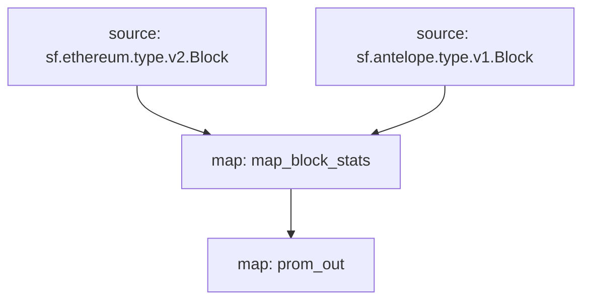

# `Subtivity` Substreams

[](https://github.com/pinax-network/subtivity-substreams/actions?query=branch%3Amain)

> Block level activity per for each supported chains **powered by Pinax**.

## Data

- [x] Transaction Count
- [x] Action Count (Events)
- [ ] UAW (Unique Active Wallets)

## Chains

- [x] Ethereum
- [x] Antelope
- [ ] Polygon
- [ ] Binance Smart Chain

### Quickstart

```
$ make
$ make run
$ make gui
```

### Graph



### Modules

```yaml
Package name: subtivity_ethereum
Version: v0.2.0
Doc: Subtivity for Ethereum
Modules:
----
Name: map_block_stats
Initial block: 0
Kind: map
Output Type: proto:subtivity.v1.BlockStats
Hash: 21ab7b9408f87679a5b0ed8a49813eada5cab9fc

Name: prom_out
Initial block: 0
Kind: map
Output Type: proto:pinax.substreams.sink.prometheus.v1.PrometheusOperations
Hash: b7fd64d243025b752759e3ca591d8ae580051a36
```
