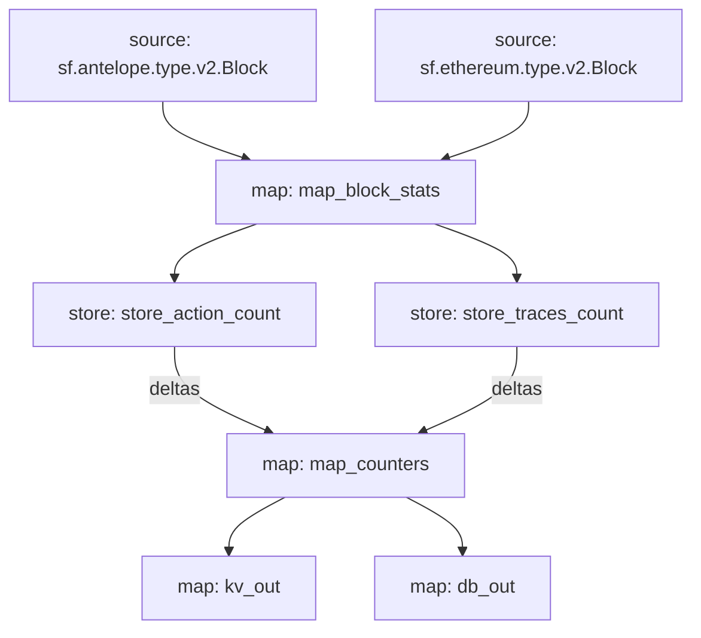

# `Subtivity` Substreams

[](https://github.com/pinax-network/subtivity-substreams/actions?query=branch%3Amain)

> Block level activity per for each supported chains **powered by Pinax**.

## Data

- [x] Transaction Count
- [x] Action Count (Events)
- [ ] UAW (Unique Active Wallets)

## Chains

- [x] Ethereum
- [x] Antelope
- [ ] Polygon
- [ ] Binance Smart Chain

### Quickstart

```
$ substreams run map_counters -t +200 -o jsonl
```

**Running no-ETH chains**

```
$ substreams run -e <ENDPOINT> substreams.<CHAIN>.yaml map_counters -t +200 -o jsonl
```

### Deploy [`Badger DB`](https://github.com/dgraph-io/badger)

1. [Installing `Badger`](https://github.com/dgraph-io/badger#installing)
2. Run the sink: `substreams-sink-kv run badger3://badger_data.db mainnet.eth.streamingfast.io:443 substreams.yaml kv_out`


### Graph



### Modules

```yaml
Package name: subtivity_ethereum
Version: v0.1.0
Doc: Subtivity for Ethereum
Modules:
----
Name: map_block_stats
Initial block: 0
Kind: map
Output Type: proto:subtivity.v1.BlockStats
Hash: 74fd20f32abf15efed4d319aac71d1d8f8644928

Name: store_traces_count
Initial block: 0
Kind: store
Value Type: int64
Update Policy: UPDATE_POLICY_ADD
Hash: f5725b6f5a268d1466a7085e5092f727f7e8ed17

Name: store_action_count
Initial block: 0
Kind: store
Value Type: int64
Update Policy: UPDATE_POLICY_ADD
Hash: 5a887f6317ded06f9997e337dd65b0e1c783c48b

Name: map_counters
Initial block: 0
Kind: map
Output Type: proto:subtivity.v1.Counters
Hash: 3b08ede52ae6461dba828a0258331e6dc1eafea9

Name: kv_out
Initial block: 0
Kind: map
Output Type: proto:sf.substreams.sink.kv.v1.KVOperations
Hash: 5574a0d7bfc078c23a9ec06a55d17693bad6d436

Name: db_out
Initial block: 0
Kind: map
Output Type: proto:sf.substreams.sink.database.v1.DatabaseChanges
Hash: 67e013577908e933b9989ebb66915f061966f47a
```
