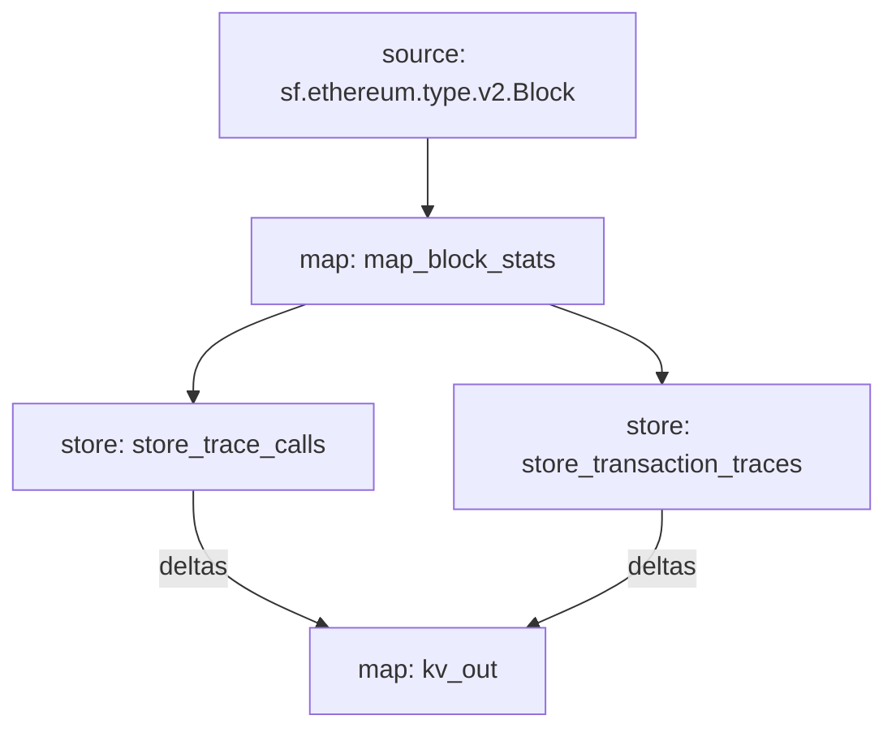

# `Subtivity` Substreams

[](https://github.com/pinax-network/subtivity-substreams/actions?query=branch%3Amain)

> Block level activity per for each supported chains **powered by Pinax**.

## Data

- [x] Transaction Count
- [x] Action Count (Events)
- [ ] UAW (Unique Active Wallets)

## Chains

- [x] Ethereum
- [x] Antelope
- [ ] Polygon
- [ ] Binance Smart Chain

### Quickstart

```
$ substreams run kv_out -s 50000 -t +3 -o jsonl
```

### Graph



**Running no-ETH chains**

```
$ substreams run -e <ENDPOINT> substreams.<CHAIN>.yaml kv_out -t +200 -o jsonl
```

### Deploy KV Sink

For testing purposes, [BadgerDB](https://dgraph.io/docs/badger/) is already included in the Substreams KV Sink, no need for any database install requirements.

```bash
$ substreams-sink-kv run badger3://badger_data.db \
  mainnet.eth.streamingfast.io:443 \
  substreams.yaml \
  kv_out
```

## Endpoints

- **Prometheus metrics server**: `localhost:9102`
- **ConnectWeb GRPC server**: `localhost:8000` (expose as reverse proxy using Nginx)

## Production deployment

- replace `subtreams.yaml` => `*.spkg GitHub release URL`
- replace `badger3://badger_data.db` => `tikv://pd0,pd1,pd2:2379?prefix=namespace_prefix`

[More info here](https://substreams.streamingfast.io/developers-guide/substreams-sinks/substreams-sink-kv#sending-to-a-production-key-value-store)

## Nginx

ConnectWeb server will need to be exposed as a public gRPC endpoint.

```nginx
server {
      listen 443 http2;
      listen [::]:443 http2;
      location / {
            grpc_pass grpc://localhost:8000;
      }
}
```

## Key Format

- **Format**: `<type>:<chain_id>:<interval>:<seconds>`
- **Example**: `trace_calls:eth:86400:1525132800`

## Value Format (bytes)

Decoding Base64 String

```js
> Buffer.from("Nzc4MTMz","base64").toString()
'778133'
```

## Query Data

```
$ grpcurl --plaintext -d '{"limit":3}' localhost:8000 sf.substreams.sink.kv.v1.Kv/Scan
```

| Method        | Request    |
|---------------|------------|
| `Get`         | `{"key":"trace_calls:eth:86400:1525132800"}`
| `GetMany`     | `{"keys":["trace_calls:eth:86400:1525132800","trace_calls:eth:86400:1525046400"]}`
| `GetByPrefix` | `{"prefix":"trace_calls:eth:86400"}`
| `Scan`        | `{"limit":1000}`

### Modules

```yaml
Package name: subtivity_ethereum
Version: v0.1.2
Doc: Subtivity for Ethereum
Modules:
----
Name: map_block_stats
Initial block: 0
Kind: map
Output Type: proto:subtivity.v1.BlockStats
Hash: 8cf876aff1c5c206d2e7c4dc2186fe614e6d6181

Name: store_transaction_traces
Initial block: 0
Kind: store
Value Type: int64
Update Policy: UPDATE_POLICY_ADD
Hash: a1bc0f77d0b941bba7b4a051665f8b8a0e26cc19

Name: store_trace_calls
Initial block: 0
Kind: store
Value Type: int64
Update Policy: UPDATE_POLICY_ADD
Hash: 26458e33cb32669e6d700798016bb257bcad2416

Name: kv_out
Initial block: 0
Kind: map
Output Type: proto:sf.substreams.sink.kv.v1.KVOperations
Hash: 0940ef858d68a7fd15c37ff3fd5420f196af0d2c
```
