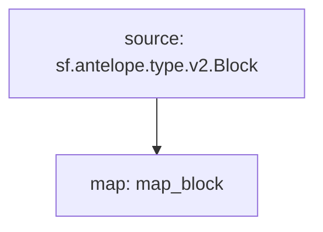

# **Subtivity** Block for `Antelope`

### Quickstart

```
$ substreams run -e eos.firehose.eosnation.io:9001 substreams.yaml map_block -s 290000000 -t +10
```

### Graph



### Modules

```yaml
Package name: subtivity_block_antelope
Version: v0.1.0
Doc: Subtivity Block for Antelope
Modules:
----
Name: map_block
Initial block: 0
Kind: map
Output Type: proto:subtivity.v1.BlockStats
Hash: fbdad3b58009176e94a1552b606695a7a0b176c2
```