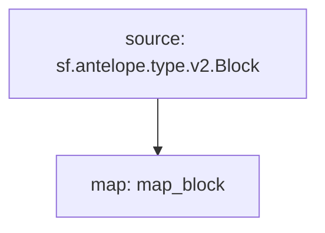

# **Subtivity** Block for `Antelope`

### Quickstart

```
$ substreams run -e eos.firehose.eosnation.io:9001 substreams.yaml map_block -t +100 --production-mode
```

### Graph



### Modules

```yaml
Package name: subtivity_block_antelope
Version: v0.1.0
Doc: Subtivity Block for Antelope.
Modules:
----
Name: map_block
Initial block: 0
Kind: map
Output Type: proto:subtivity.v1.BlockSubtivity
Hash: 5443ccdfd0104ac2750d0ba5c4afa6a7ef5128af
```