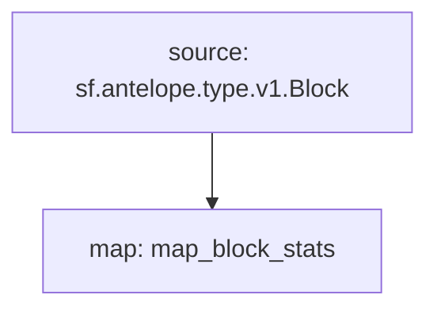

# **Subtivity** Block for `Antelope`

### Quickstart

```bash
$ make
$ make run
$ make gui
```

### Graph



### Modules

```yaml
Package name: subtivity_block_stats_antelope
Version: v0.1.0
Doc: Subtivity Block stats for Antelope
Modules:
----
Name: map_block_stats
Initial block: 0
Kind: map
Output Type: proto:subtivity.v1.BlockStats
Hash: d35204c532e401ee7b1bbf5260c46a6522da0f1f
```