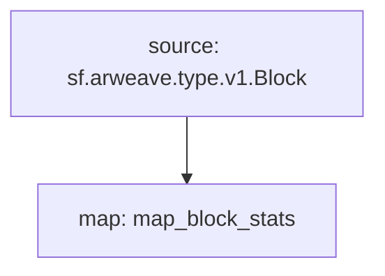

# **Subtivity** Block for `Arweave`

### Quickstart

```bash
$ make
$ make run
$ make gui
```

### Graph



### Modules

```yaml
Package name: subtivity_block_stats_arweave
Version: v0.1.0
Doc: Subtivity Block stats for Arweave
Modules:
----
Name: map_block_stats
Initial block: 0
Kind: map
Output Type: proto:subtivity.v1.BlockStats
Hash: ba5a3c8ecc0cae6f598dbdd34fb1297fee449356
```