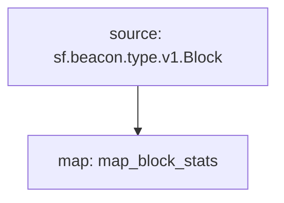

# **Subtivity** Block for `Ethereum` Beacon Chain

### Quickstart

```bash
$ make
$ make run
$ make gui
```

### Graph



### Modules

```yaml
Package name: subtivity_block_stats_ethereum_beacon
Version: v0.1.0
Doc: Subtivity Block stats for Ethereum Beacon Chain
Modules:
----
Name: map_block_stats
Initial block: 0
Kind: map
Output Type: proto:subtivity.v1.BlockStats
Hash: d4755a74dd1195bd95d0a9a7cc2193ba0e6432ee
```