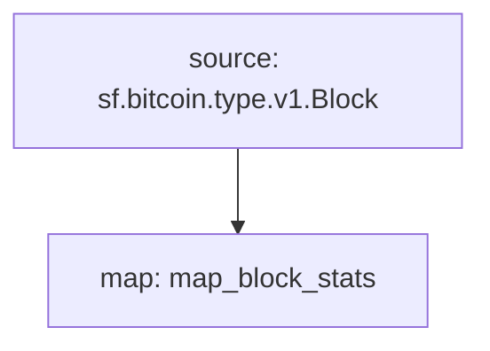

# **Subtivity** Block for `Bitcoin`

### Quickstart

```bash
$ make
$ make run
$ make gui
```

### Graph



### Modules

```yaml
Package name: subtivity_block_stats_bitcoin
Version: v0.1.0
Doc: Subtivity Block stats for Bitcoin
Modules:
----
Name: map_block_stats
Initial block: 0
Kind: map
Output Type: proto:subtivity.v1.BlockStats
Hash: 061e12088a8f5b3b3af1d352b093ca07b0d673dd
```