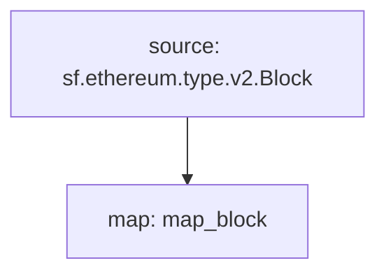

# **Subtivity** Block for `ETH`

### Quickstart

```
$ substreams run map_block -s 16500000 -t +1
```

### Graph



### Modules

```yaml
Package name: subtivity_block_eth
Version: v0.1.0
Doc: Subtivity Block for ETH
Modules:
----
Name: map_block
Initial block: 0
Kind: map
Output Type: proto:subtivity.v1.BlockStats
Hash: 231b13163f6dc43e8f0bed2a2436a610fab384b6
```