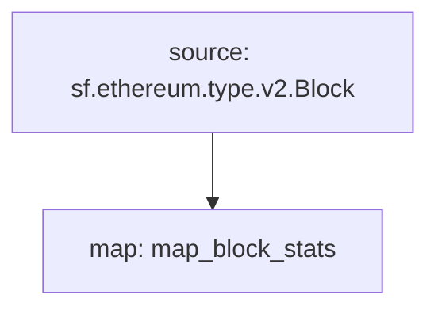

# **Subtivity** Block for `Ethereum`

### Quickstart

```
$ substreams run map_block_stats -s 16500000 -t +1
```

### Graph



### Modules

```yaml
Package name: subtivity_block_stats_ethereum
Version: v0.1.0
Doc: Subtivity Block stats for Ethereum
Modules:
----
Name: map_block_stats
Initial block: 0
Kind: map
Output Type: proto:subtivity.v1.BlockStats
Hash: 74fd20f32abf15efed4d319aac71d1d8f8644928
```