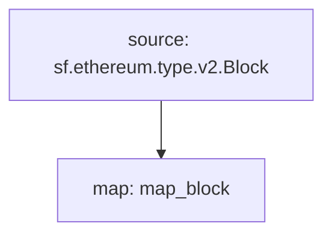

# **Subtivity** Block for `EVM`

### Quickstart

```
$ substreams run -e mainnet.eth.streamingfast.io:443 substreams.yaml map_block -t +100 --production-mode
```

### Graph



### Modules

```yaml
Package name: subtivity_block_evm
Version: v0.1.0
Doc: Subtivity Block for EVM.
Modules:
----
Name: map_block
Initial block: 0
Kind: map
Output Type: proto:subtivity.v1.BlockSubtivity
Hash: 6329c25a2d18f1de6c09fcffbfac6e33f7180dbc
```