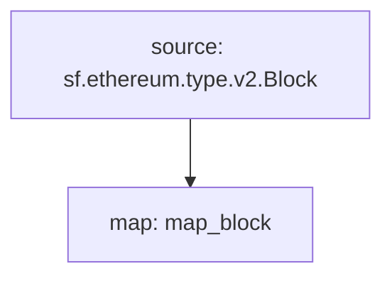

# **Subtivity** Block for `EVM`

### Quickstart

```
$ substreams run substreams.yaml map_block -s 16500000 -t +10
```

### Graph



### Modules

```yaml
Package name: subtivity_block_evm
Version: v0.1.0
Doc: Subtivity Block for EVM.
Modules:
----
Name: map_block
Initial block: 0
Kind: map
Output Type: proto:subtivity.v1.BlockSubtivity
Hash: c82ddbb26f660b194707471cecfe0a61f19d1813
```