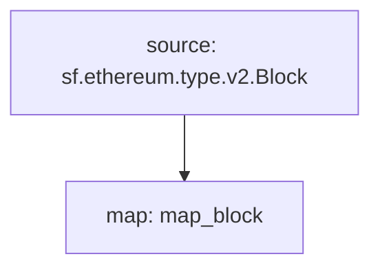

# **Subtivity** Block for `EVM`

### Quickstart

```
$ substreams run map_block -s 16500000 -t +1
```

### Graph



### Modules

```yaml
Package name: subtivity_block_evm
Version: v0.1.0
Doc: Subtivity Block for EVM
Modules:
----
Name: map_block
Initial block: 0
Kind: map
Output Type: proto:subtivity.v1.BlockStats
Hash: caace6a4307b3e38e1bd7a33e5ad519cd31f578d
```