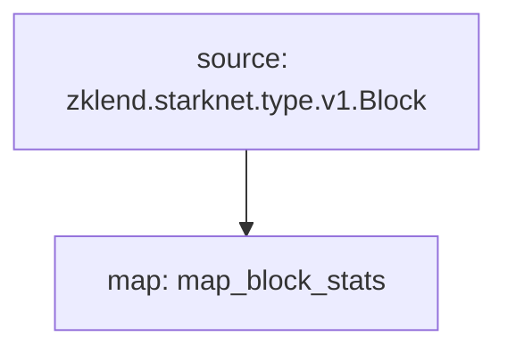

# **Subtivity** Block for `Near`

### References

- https://github.com/starknet-graph/firehose-starknet/blob/master/proto/zklend/starknet/type/v1/type.proto

### Quickstart

```bash
$ make
$ make run
$ make gui
```

### Graph



### Modules

```yaml
Package name: subtivity_block_stats_starknet
Version: v0.1.0
Doc: Subtivity Block stats for Starknet
Modules:
----
Name: map_block_stats
Initial block: 0
Kind: map
Output Type: proto:subtivity.v1.BlockStats
Hash: 006f4c7dde040aae19d74bf599ff933f8e4eeb07
```