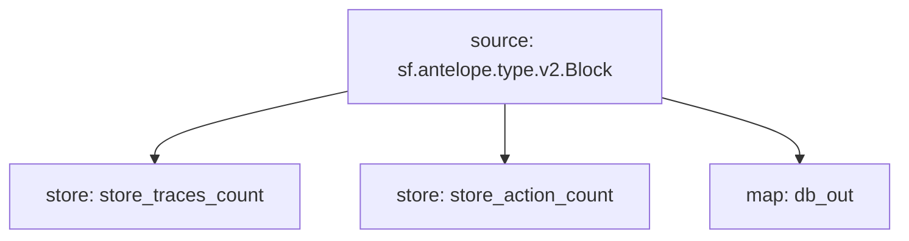

# **Subtivity** for `Antelope`

### Quickstart

```
$ substreams run -e eos.firehose.eosnation.io:9001 substreams.yaml db_out --stop-block 10000 --production-mode
```

### Graph



### Modules

```yaml
Name: store_traces_count
Initial block: 0
Kind: store
Value Type: int64
Update Policy: UPDATE_POLICY_ADD
Hash: 67d4cf7409fe14dd0d12c20135cb24a27c62d088

Name: store_action_count
Initial block: 0
Kind: store
Value Type: int64
Update Policy: UPDATE_POLICY_ADD
Hash: 2d98d1429a8f2c8135e9ff7357e6404a188c89e3

Name: db_out
Initial block: 0
Kind: map
Output Type: proto:sf.substreams.database.v1.DatabaseChanges
Hash: 48acec56e03db12ed576037be9c1a76d8c941323
```