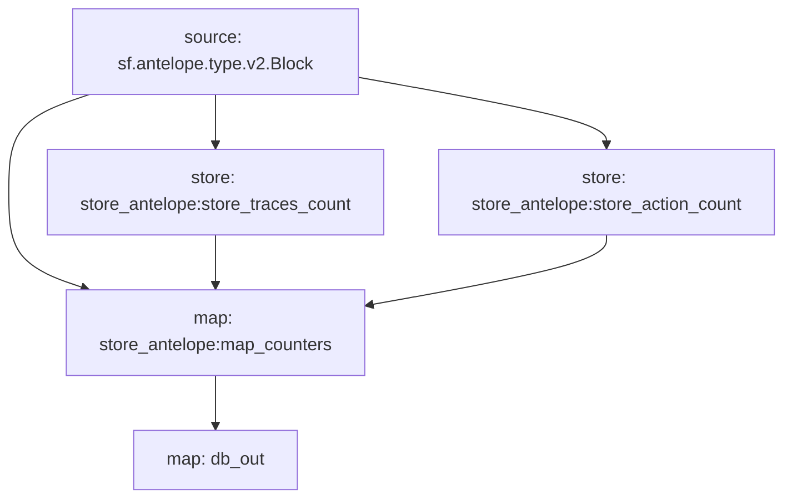

# **Subtivity** for `Antelope`

### Quickstart

```
$ substreams run -e eos.firehose.eosnation.io:9001 substreams.yaml db_out -t 172800 --production-mode -o jsonl
```

### Graph



### Modules

```yaml
Name: db_out
Initial block: 0
Kind: map
Output Type: proto:sf.substreams.database.v1.DatabaseChanges
Hash: 291cfb0d1c0170d75310f7861a8badb02aa72b66

Name: store_antelope:store_traces_count
Initial block: 0
Kind: store
Value Type: int64
Update Policy: UPDATE_POLICY_ADD
Hash: 8659be5bb631ae28da94e7ceddf11b9f7492763c

Name: store_antelope:store_action_count
Initial block: 0
Kind: store
Value Type: int64
Update Policy: UPDATE_POLICY_ADD
Hash: 3d1143b5be2f4cdf853ba122b37d08bde2838183

Name: store_antelope:map_counters
Initial block: 0
Kind: map
Output Type: proto:subtivity.v1.Counters
Hash: d3ab6c399728166bc92b72e280ec38237aa4c067
```