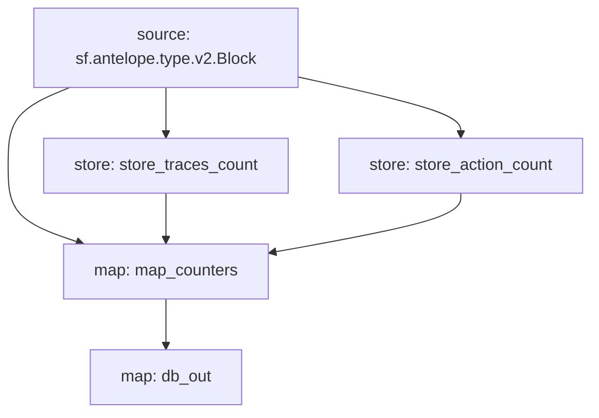

# **Subtivity** for `Antelope`

### Quickstart

```
$ substreams run -e eos.firehose.eosnation.io:9001 substreams.yaml db_out -t 172800 --production-mode -o jsonl
```

### Graph



### Modules

```yaml
Package name: subtivity_antelope
Version: v0.1.0
Doc: Subtivity for Antelope.
Modules:
----
Name: store_traces_count
Initial block: 0
Kind: store
Value Type: int64
Update Policy: UPDATE_POLICY_ADD
Hash: 91b044395a123c29005b48a8aa5c17e4f27c2ec5

Name: store_action_count
Initial block: 0
Kind: store
Value Type: int64
Update Policy: UPDATE_POLICY_ADD
Hash: b95592a900a0459292c47bea4b6aece3479e260d

Name: map_counters
Initial block: 0
Kind: map
Output Type: proto:subtivity.v1.Counters
Hash: d9bb6ef6f6dca4df545d8c7041a30ed866f32188

Name: db_out
Initial block: 0
Kind: map
Output Type: proto:sf.substreams.database.v1.DatabaseChanges
Hash: 93405b25892d19e5ac3035f6ef65a853ea740795
```