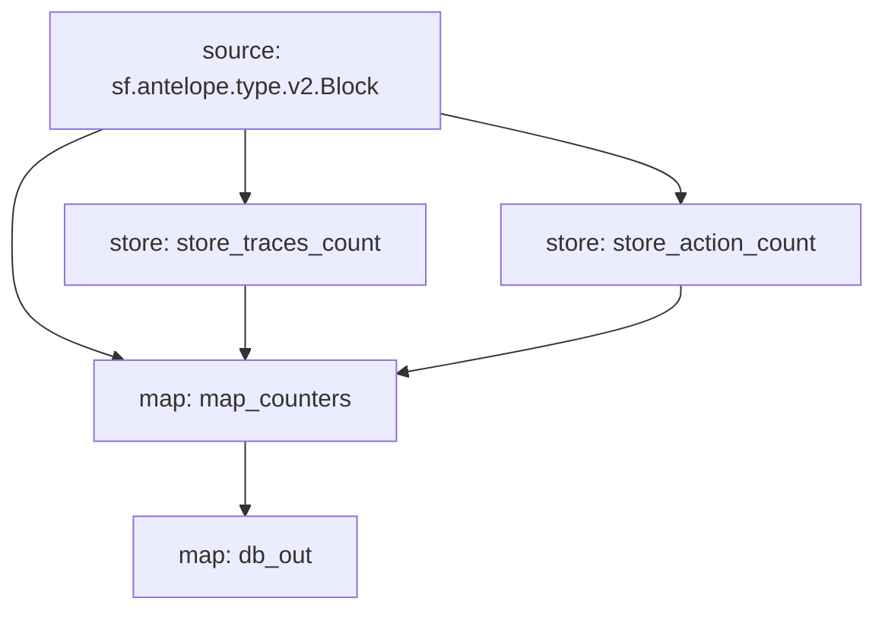

# **Subtivity** for `Antelope`

### Quickstart

```
$ substreams run -e eos.firehose.eosnation.io:9001 substreams.yaml db_out -t 172800 --production-mode -o jsonl
```

### Graph



### Modules

```yaml
ackage name: subtivity_antelope
Version: v0.1.0
Doc: Subtivity for Antelope.
Modules:
----
Name: store_traces_count
Initial block: 0
Kind: store
Value Type: int64
Update Policy: UPDATE_POLICY_ADD
Hash: 78db987cd8ffe486b0d8e6d001ee429e326338c4

Name: store_action_count
Initial block: 0
Kind: store
Value Type: int64
Update Policy: UPDATE_POLICY_ADD
Hash: ea5664ef51fcd1df33d41a25ce2243399717d89c

Name: map_counters
Initial block: 0
Kind: map
Output Type: proto:subtivity.v1.Counters
Hash: 2cf1d2bb26e3c0623d4b730471ec515451a2dd67

Name: db_out
Initial block: 0
Kind: map
Output Type: proto:sf.substreams.database.v1.DatabaseChanges
Hash: 3a4f52d19c5934061511f5ef3eb9e89ec2e47bd3
```