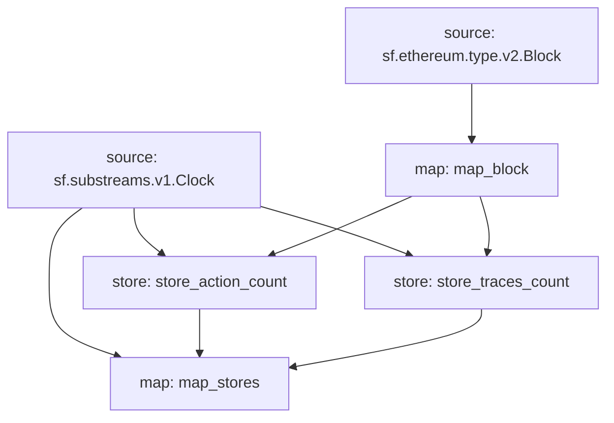

# **Subtivity** Stores

### Quickstart

```
$ substreams run map_stores -s 1000 -t +1 --production-mode
$ substreams run -e eos.firehose.eosnation.io:9001 substreams.antelope.yaml map_stores -s 1000 -t +1  --production-mode
```

### Graph



### Modules

```yaml
Package name: subtivity_stores_evm
Version: v0.1.0
Doc: Subtivity Stores for EVM.
Modules:
----
Name: map_block
Initial block: 0
Kind: map
Output Type: proto:subtivity.v1.BlockStats
Hash: c82ddbb26f660b194707471cecfe0a61f19d1813

Name: store_traces_count
Initial block: 0
Kind: store
Value Type: int64
Update Policy: UPDATE_POLICY_ADD
Hash: fb8970ca5049e766827902440a359b251ee65a3f

Name: store_action_count
Initial block: 0
Kind: store
Value Type: int64
Update Policy: UPDATE_POLICY_ADD
Hash: 3e6e1033854a642630aa78824166d3e5b991f7a0

Name: map_stores
Initial block: 0
Kind: map
Output Type: proto:sf.substreams.v1.Clock
Hash: add7dc82fb19d99292a3b5a18f77207de894d763
```